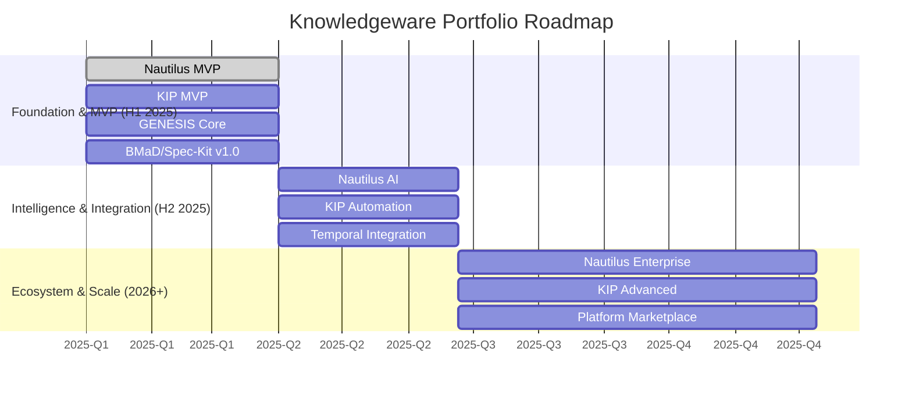

# Knowledgeware Portfolio Roadmap

**Version:** 1.0  
**Date:** 2025-12-19  
**Status:** Draft

## 1. Introduction

This document outlines the integrated product roadmap for the Knowledgeware portfolio, including **Nautilus**, **KIP**, and the underlying **GENESIS** platform. The roadmap is organized into three strategic horizons, each delivering incremental value and building upon the last. Our execution will be managed through a series of Programs aligned with our SAFe-based portfolio management approach.

## 2. High-Level Roadmap (2025-2026)

## 3. Horizon 1: Foundation & MVP (First Half 2025)

**Goal:** Launch Minimum Viable Products for Nautilus and KIP to validate core value propositions and establish a foundational user base.

### Program: Nautilus MVP
-   **Epic:** Core DevSecOps Automation
-   **Features:**
    -   Implement the "Dual Source of Truth" pattern with NetBox and GitLab.
    -   Automate IaC generation (Terraform/Ansible) from NetBox data.
    -   Integrate with OpenBao for secrets management.
    -   Deliver a robust CLI for manual workflow execution.
-   **Outcome:** A developer can define infrastructure in NetBox and use Nautilus to generate and deploy the corresponding IaC, reducing manual effort by >50%.

### Program: KIP MVP
-   **Epic:** Foundational Knowledge Base
-   **Features:**
    -   Establish Zotero and Obsidian integration for manual knowledge capture.
    -   Deploy Weaviate with basic cross-references for knowledge linking.
    -   Implement a simple UI (Streamlit) for keyword and semantic search.
    -   Bootstrap the "Knowledge Management" domain KB.
-   **Outcome:** A knowledge worker can capture, link, and search for information across a curated set of documents, creating a centralized, searchable knowledge hub.

### Program: GENESIS Core Platform
-   **Epic:** Stabilize Core Services
-   **Features:**
    -   Production-harden the MCP Host and Visualization services.
    -   Formalize the connector architecture.
    -   Implement basic OPA policies for access control.
-   **Outcome:** A stable, secure, and observable platform for building and deploying AI-integrated applications.

## 4. Horizon 2: Intelligence & Integration (Second Half 2025)

**Goal:** Infuse the product suite with advanced AI capabilities and durable workflow automation.

### Program: Nautilus AI
-   **Epic:** AI-Driven Intent Translation
-   **Features:**
    -   Integrate CrewAI to translate natural language requests into Nautilus work packages.
    -   Implement a human-in-the-loop approval workflow for AI-generated plans.
    -   Develop a feedback mechanism to train the AI agents.
-   **Outcome:** A platform engineer can say, "Deploy a new web server cluster in the staging environment," and Nautilus will generate the complete, auditable plan for approval.

### Program: KIP Automation
-   **Epic:** Durable Cognitive Workflows
-   **Features:**
    -   Integrate Temporal.io to orchestrate long-running knowledge analysis tasks.
    -   Automate knowledge ingestion from sources like Git repositories and Confluence.
    -   Implement the first version of the "Librarian's Report" for KB health monitoring.
-   **Outcome:** KIP can autonomously monitor knowledge sources, ingest new information, and perform deep analysis over hours or days, surfacing novel insights without human intervention.

## 5. Horizon 3: Ecosystem & Scale (2026 and beyond)

**Goal:** Scale the platform, foster a community, and enable enterprise-wide adoption.

### Program: Nautilus Enterprise
-   **Epic:** Enterprise-Grade DevSecOps
-   **Features:**
    -   Integrate with Backstage.io for a seamless developer experience.
    -   Add support for ServiceNow CMDB synchronization.
    -   Implement advanced RBAC and multi-tenancy.
-   **Outcome:** Nautilus becomes the central nervous system for IT operations in large enterprises.

### Program: KIP Advanced
-   **Epic:** From Intelligence to Wisdom
-   **Features:**
    -   Implement "The Codex" for distilling and tracking core principles.
    -   Deploy the "Dissenting Agent" to challenge assumptions and reduce bias.
    -   Integrate Neo4j for advanced graph analytics and structural insights.
-   **Outcome:** KIP evolves from a knowledge retrieval system into a wisdom generation platform that actively helps organizations think better.

### Program: Platform Ecosystem
-   **Epic:** Community & Marketplace
-   **Features:**
    -   Launch a public marketplace for BMaD agents and KIP knowledge domains.
    -   Develop a partner program for custom integrations.
    -   Host community events and hackathons.
-   **Outcome:** Knowledgeware becomes a thriving ecosystem and the de facto standard for building enterprise-grade AI solutions.
