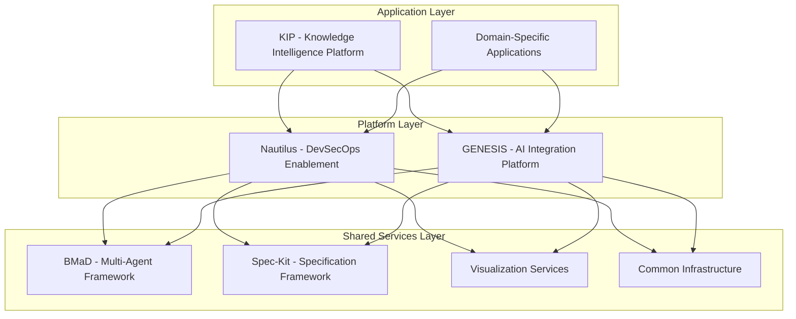

# Knowledgeware Product Portfolio Strategy

**Version:** 1.0  
**Date:** 2025-12-19  
**Status:** Draft

## 1. Executive Summary

This document outlines the strategic vision, product architecture, and portfolio management approach for the **Knowledgeware Product Suite**. Knowledgeware is an integrated portfolio of enterprise-grade software products designed to enable **AI-enhanced knowledge management** and **intelligent DevSecOps automation**. 

Our core strategy is to build a **Platform + Applications** ecosystem that leverages a shared foundation of AI integration, data orchestration, and workflow automation to deliver specialized value to distinct user segments. The portfolio is developed using a **dogfooding methodology**, where we use our own products to build, manage, and evolve the suite, ensuring practical validation and continuous improvement.

## 2. Strategic Vision

**To empower enterprises with a durable cognitive infrastructure that transforms distributed knowledge into actionable intelligence and automates complex operational workflows.**

We believe the future of enterprise productivity lies in a seamless partnership between human expertise and AI-driven systems. Knowledgeware provides the foundational platform to make this partnership a reality, moving beyond simple automation to create a self-improving, intelligent ecosystem.

## 3. Product Portfolio Architecture

The Knowledgeware suite is structured as a multi-layered **Platform + Applications** model:

### 3.1. Product Lines & Value Propositions

| Product Line | Name | Value Proposition | Target Users | Implementation Status |
| :--- | :--- | :--- | :--- | :--- |
| **Platform** | **Nautilus** | Automate and govern enterprise DevSecOps toolchains with an AI-ready integration platform. | Platform Engineers, DevSecOps Teams | ~65% (GENESIS foundation) |
| **Platform** | **GENESIS** | Provide a secure, policy-driven integration backbone for AI agents to interact with enterprise systems. | AI Developers, System Integrators | ~65% (Core services implemented) |
| **Application** | **KIP** | Transform distributed organizational knowledge into actionable intelligence using durable AI workflows. | Knowledge Workers, Researchers, Analysts | ~15% (Architecture complete) |
| **Shared Service** | **BMaD** | A methodology for designing, building, and managing collaborative multi-agent AI systems. | AI Architects, Development Teams | Applied in GENESIS & KIP |
| **Shared Service** | **Spec-Kit** | A framework for creating structured, machine-readable specifications for AI solutions. | Product Managers, System Analysts | Referenced, needs formalization |

### 3.2. Product Relationships & Boundaries

- **Nautilus is the productized version of the GENESIS platform**, focused specifically on the DevSecOps domain. GENESIS provides the core AI integration capabilities, while Nautilus packages them with specific tools and workflows for infrastructure automation.
- **KIP is a consumer of the Nautilus/GENESIS platform**. It leverages the platform to access and process knowledge from infrastructure and service management systems, but its core focus is on domain-agnostic knowledge synthesis.
- **BMaD and Spec-Kit are methodologies and frameworks** that underpin the development of all products in the suite. They ensure consistency, quality, and a shared approach to AI-driven development.

## 4. Market Opportunity & Positioning

### 4.1. Target Market

Enterprises with complex IT environments, significant investments in DevSecOps, and a strategic focus on leveraging AI for operational efficiency and competitive advantage.

### 4.2. Competitive Landscape

- **DevSecOps Automation:** HashiCorp, Ansible, Puppet, Chef
- **AI for IT Operations (AIOps):** Dynatrace, Datadog, Splunk
- **Knowledge Management:** Microsoft 365 Copilot, Glean, Notion
- **Integration Platform as a Service (iPaaS):** MuleSoft, Boomi

### 4.3. Unique Differentiators

Knowledgeware's unique value proposition lies in the **synergy between its products**:

1. **Integrated Intelligence:** We don't just automate infrastructure (like HashiCorp) or manage knowledge (like Notion); we create an intelligent feedback loop between them.
2. **Durable Cognition:** Unlike stateless automation scripts, our Temporal.io-based workflows enable long-running, stateful cognitive processes that can reason and learn over time.
3. **Governance by Design:** Our platform is built with a security-first mindset, incorporating policy enforcement (OPA) and human-in-the-loop approvals from day one.
4. **Transparent Methodology:** BMaD and Spec-Kit provide a clear, repeatable framework for building enterprise-grade AI solutions, de-risking AI adoption for our customers.

## 5. Go-to-Market Strategy

1. **Phase 1: Open Source & Community Building**
   - Open source the BMaD and Spec-Kit frameworks to build a community and establish thought leadership.
   - Release a community edition of Nautilus with core GENESIS features.

2. **Phase 2: Enterprise Offering**
   - Launch an enterprise version of Nautilus with advanced features, support, and consulting.
   - Introduce KIP as a premium application on the Nautilus platform.

3. **Phase 3: Ecosystem & Marketplace**
   - Develop a marketplace for third-party BMaD agents and KIP knowledge domains.
   - Foster a partner ecosystem for custom integrations and solutions.

## 6. Portfolio Management

We will use a lightweight implementation of **SAFe Lean Portfolio Management** to guide our investment and execution.

### 6.1. Strategic Themes

- **Theme 1: Accelerate DevSecOps Automation** (Nautilus Focus)
- **Theme 2: Unlock Enterprise Intelligence** (KIP Focus)
- **Theme 3: Foster a Thriving AI Ecosystem** (Platform & Community Focus)

### 6.2. Value Streams

- **Infrastructure Automation Value Stream:** Delivers features for Nautilus and GENESIS.
- **Knowledge Intelligence Value Stream:** Delivers features for KIP and related applications.
- **Platform Services Value Stream:** Delivers shared services and frameworks (BMaD, Spec-Kit, etc.).

## 7. Key Performance Indicators (KPIs)

- **Portfolio:** Total Contract Value (TCV), Customer Lifetime Value (CLV)
- **Nautilus:** Mean Time to Recovery (MTTR), Deployment Frequency, Change Failure Rate
- **KIP:** Knowledge Retrieval Accuracy, Time to Insight, User Engagement
- **Community:** Number of contributors, framework adoption, marketplace activity

## 8. Next Steps

1. **Finalize Product Taxonomy:** Solidify the branding and boundaries between GENESIS and Nautilus.
2. **Develop Portfolio Roadmap:** Create a detailed, multi-phase roadmap with clear milestones.
3. **Initiate Sprint 0:** Begin the first implementation sprint focused on bootstrapping the core infrastructure.
4. **Formalize BMaD/Spec-Kit:** Package the methodologies for public release.

---

*This strategy document provides the guiding vision for the Knowledgeware portfolio, creating a coherent and powerful suite of products that will define the future of AI-driven enterprise operations.*
