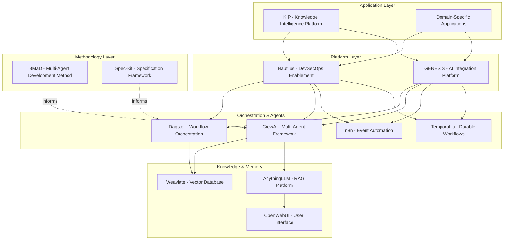

# Knowledgeware Product Portfolio Strategy (Updated)

**Version:** 1.1  
**Date:** 2025-12-19  
**Status:** Final

## 1. Executive Summary

This document outlines the strategic vision, product architecture, and portfolio management approach for the **Knowledgeware Product Suite**. Knowledgeware is an integrated portfolio of enterprise-grade software products designed to enable **AI-enhanced knowledge management** and **intelligent DevSecOps automation**.

Our core strategy is to build a **Platform + Applications** ecosystem that leverages a shared foundation of AI integration, data orchestration, and workflow automation to deliver specialized value to distinct user segments. The portfolio is developed using a **dogfooding methodology**, where we use our own products to build, manage, and evolve the suite, ensuring practical validation and continuous improvement.

**Key Update (v1.1):** This version incorporates insights from the BMaD and Spec-Kit framework analysis, clarifying the strategic role of these methodologies as the **operational DNA** of the Knowledgeware suite.

## 2. Strategic Vision

**To empower enterprises with a durable cognitive infrastructure that transforms distributed knowledge into actionable intelligence and automates complex operational workflows.**

We believe the future of enterprise productivity lies in a seamless partnership between human expertise and AI-driven systems. Knowledgeware provides the foundational platform to make this partnership a reality, moving beyond simple automation to create a self-improving, intelligent ecosystem powered by **multi-agent collaboration** and **durable workflows**.

## 3. Product Portfolio Architecture

The Knowledgeware suite is structured as a multi-layered **Platform + Applications + Methodology** model:

### 3.1. Product Lines & Value Propositions

| Product Line | Name | Value Proposition | Target Users | Implementation Status |
| :--- | :--- | :--- | :--- | :--- |
| **Platform** | **Nautilus** | Automate and govern enterprise DevSecOps toolchains with an AI-ready integration platform. | Platform Engineers, DevSecOps Teams | ~65% (GENESIS foundation) |
| **Platform** | **GENESIS** | Provide a secure, policy-driven integration backbone for AI agents to interact with enterprise systems. | AI Developers, System Integrators | ~65% (Core services implemented) |
| **Application** | **KIP** | Transform distributed organizational knowledge into actionable intelligence using durable AI workflows. | Knowledge Workers, Researchers, Analysts | ~15% (Architecture complete) |
| **Methodology** | **BMaD** | A comprehensive, multi-agent methodology for structuring and scaling AI-assisted software development. | AI Architects, Development Teams | Applied in GENESIS & KIP |
| **Methodology** | **Spec-Kit** | A lightweight, developer-centric toolkit for making specifications the central, executable artifact. | Product Managers, Developers | Referenced, needs formalization |

### 3.2. The Role of BMaD and Spec-Kit

**BMaD (Breakthrough Method for Agile AI-Driven Development)** and **Spec-Kit** are not just documentation frameworks—they are the **operational methodologies** that define how the Knowledgeware suite is built and how it operates.

**BMaD as the Operational DNA:**
- **CrewAI agents within GENESIS and KIP are structured according to BMaD roles** (Analyst, Architect, Developer, QA).
- The multi-phase workflow (Analysis → Planning → Architecture → Implementation) is encoded into Dagster pipelines.
- BMaD provides the governance model for human-in-the-loop approvals and quality gates.

**Spec-Kit as the Developer Interface:**
- Spec-Kit commands (`/specify`, `/plan`, `/tasks`) become the primary interface for developers interacting with Nautilus and KIP.
- Specifications created with Spec-Kit are the "source of truth" that feed into BMaD agents.
- Spec-Kit ensures that AI-generated code aligns with internal standards and compliance requirements.

**Strategic Positioning:**
- **BMaD** is our "enterprise methodology" for large, complex projects—the approach we use internally and sell to large organizations.
- **Spec-Kit** is our "developer productivity tool"—lightweight, open source, and designed to attract individual developers and small teams into the ecosystem.

### 3.3. Product Relationships & Boundaries

- **Nautilus is the productized version of the GENESIS platform**, focused specifically on the DevSecOps domain. GENESIS provides the core AI integration capabilities, while Nautilus packages them with specific tools and workflows for infrastructure automation.
- **KIP is a consumer of the Nautilus/GENESIS platform**. It leverages the platform to access and process knowledge from infrastructure and service management systems, but its core focus is on domain-agnostic knowledge synthesis.
- **BMaD and Spec-Kit are methodologies** that underpin the development of all products in the suite AND define how users interact with the products. They ensure consistency, quality, and a shared approach to AI-driven development.
- **CrewAI, Dagster, Temporal.io, and Weaviate** are the **technology building blocks** that implement the BMaD and Spec-Kit methodologies at scale.

## 4. Market Opportunity & Positioning

### 4.1. Target Market

Enterprises with complex IT environments, significant investments in DevSecOps, and a strategic focus on leveraging AI for operational efficiency and competitive advantage.

### 4.2. Competitive Landscape

- **DevSecOps Automation:** HashiCorp, Ansible, Puppet, Chef
- **AI for IT Operations (AIOps):** Dynatrace, Datadog, Splunk
- **Knowledge Management:** Microsoft 365 Copilot, Glean, Notion
- **Integration Platform as a Service (iPaaS):** MuleSoft, Boomi
- **AI Development Methodologies:** GitHub Copilot, Cursor, Replit

### 4.3. Unique Differentiators

Knowledgeware's unique value proposition lies in the **synergy between its products and methodologies**:

1.  **Integrated Intelligence:** We don't just automate infrastructure (like HashiCorp) or manage knowledge (like Notion); we create an intelligent feedback loop between them using multi-agent systems.
2.  **Durable Cognition:** Unlike stateless automation scripts, our Temporal.io-based workflows enable long-running, stateful cognitive processes that can reason and learn over time.
3.  **Governance by Design:** Our platform is built with a security-first mindset, incorporating policy enforcement (OPA) and human-in-the-loop approvals from day one.
4.  **Transparent Methodology:** BMaD and Spec-Kit provide a clear, repeatable framework for building enterprise-grade AI solutions, de-risking AI adoption for our customers.
5.  **Multi-Agent Orchestration:** By leveraging CrewAI and the BMaD methodology, we can tackle complex, multi-domain problems that single-agent systems struggle with.

## 5. Go-to-Market Strategy

1.  **Phase 1: Open Source & Community Building (Q1-Q2 2025)**
    - Open source the **Spec-Kit** framework to build a community and establish thought leadership among developers.
    - Release a community edition of **Nautilus** with core GENESIS features.
    - Publish case studies and tutorials on applying **BMaD** to real-world projects.

2.  **Phase 2: Enterprise Offering (Q3-Q4 2025)**
    - Launch an enterprise version of **Nautilus** with advanced features (Backstage.io integration, RBAC, multi-tenancy), support, and consulting.
    - Introduce **KIP** as a premium application on the Nautilus platform.
    - Offer **BMaD consulting services** to help enterprises adopt the methodology.

3.  **Phase 3: Ecosystem & Marketplace (2026+)**
    - Develop a marketplace for third-party **BMaD agents** and **KIP knowledge domains**.
    - Foster a partner ecosystem for custom integrations and solutions.
    - Establish Knowledgeware as the de facto standard for enterprise AI orchestration.

## 6. Portfolio Management

We will use a lightweight implementation of **SAFe Lean Portfolio Management** to guide our investment and execution.

### 6.1. Strategic Themes

- **Theme 1: Accelerate DevSecOps Automation** (Nautilus Focus)
- **Theme 2: Unlock Enterprise Intelligence** (KIP Focus)
- **Theme 3: Foster a Thriving AI Ecosystem** (Platform & Community Focus)

### 6.2. Value Streams

- **Infrastructure Automation Value Stream:** Delivers features for Nautilus and GENESIS.
- **Knowledge Intelligence Value Stream:** Delivers features for KIP and related applications.
- **Platform Services Value Stream:** Delivers shared services and frameworks (BMaD, Spec-Kit, CrewAI integration, etc.).

## 7. Key Performance Indicators (KPIs)

- **Portfolio:** Total Contract Value (TCV), Customer Lifetime Value (CLV), Community Engagement (GitHub stars, forum activity)
- **Nautilus:** Mean Time to Recovery (MTTR), Deployment Frequency, Change Failure Rate
- **KIP:** Knowledge Retrieval Accuracy, Time to Insight, User Engagement
- **BMaD/Spec-Kit:** Adoption Rate (downloads, implementations), Contribution Rate (community PRs)

## 8. Next Steps

1.  **Finalize Product Taxonomy:** Solidify the branding and boundaries between GENESIS and Nautilus (COMPLETE).
2.  **Develop Portfolio Roadmap:** Create a detailed, multi-phase roadmap with clear milestones (COMPLETE).
3.  **Formalize BMaD/Spec-Kit:** Package the methodologies for public release with documentation, examples, and templates (IN PROGRESS - artifacts integrated).
4.  **Initiate Sprint 0:** Begin the first implementation sprint focused on bootstrapping the core infrastructure.

---

*This strategy document provides the guiding vision for the Knowledgeware portfolio, creating a coherent and powerful suite of products that will define the future of AI-driven enterprise operations. By integrating BMaD and Spec-Kit as both our internal development methodology and our external value proposition, we create a unique competitive advantage and a clear path to market leadership.*
