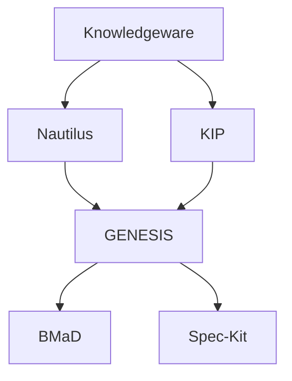
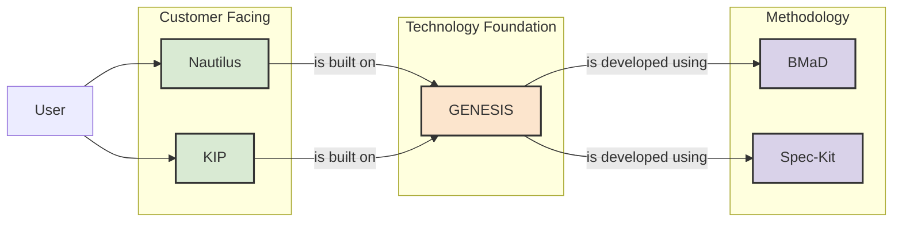

# Knowledgeware Product Taxonomy & Relationship Map

**Version:** 1.0  
**Date:** 2025-12-19  
**Status:** Draft

## 1. Introduction

This document defines the product taxonomy for the Knowledgeware suite, clarifying the boundaries, relationships, and branding of each product. It serves as a guide for development, marketing, and strategic planning.

## 2. Product Hierarchy

The Knowledgeware suite is organized into three tiers:

1.  **Portfolio:** The overarching brand and ecosystem (`Knowledgeware`).
2.  **Product Lines:** The core, customer-facing products (`Nautilus`, `KIP`).
3.  **Component Brands:** The underlying platforms, frameworks, and methodologies that power the product lines (`GENESIS`, `BMaD`, `Spec-Kit`).

## 3. Product Definitions & Branding

### 3.1. Nautilus

-   **Full Name:** Nautilus DevSecOps Enablement Platform
-   **Tagline:** *Navigate Your Infrastructure with Intelligent Automation.*
-   **Description:** Nautilus is an enterprise-grade platform that provides a unified control plane for automating and governing complex DevSecOps toolchains. It uses AI-driven workflows to orchestrate infrastructure provisioning, configuration management, and security operations, turning high-level intent into auditable, automated actions.
-   **Core Features:**
    -   Integration with NetBox, GitLab, OpenTofu, Ansible, OpenBao
    -   AI-powered intent-to-command translation
    -   Policy-as-code enforcement (OPA)
    -   Durable, auditable workflows (Temporal.io)
    -   Backstage.io integration for service cataloging

### 3.2. KIP (Knowledge Intelligence Platform)

-   **Full Name:** KIP (Knowledge Intelligence Platform)
-   **Tagline:** *Transform Your Data into Durable Wisdom.*
-   **Description:** KIP is an application that runs on the Nautilus platform, designed to ingest, process, and synthesize distributed organizational knowledge. It uses advanced AI techniques, including vector search, graph analytics, and multi-agent systems, to create a living, self-improving knowledge base that helps teams make better decisions, faster.
-   **Core Features:**
    -   Automated knowledge ingestion from multiple sources
    -   Semantic and graph-based knowledge query
    -   Durable cognitive workflows for deep analysis
    -   "The Codex" for distilling and tracking core principles
    -   "Dissenting Agent" for challenging assumptions and reducing bias

### 3.3. GENESIS

-   **Full Name:** GENESIS AI Integration Platform
-   **Tagline:** *The Origin of Context for Intelligent Systems.*
-   **Description:** GENESIS is the **component brand** for the core integration and AI orchestration engine that powers both Nautilus and KIP. It is not a standalone product but rather the foundational technology layer that provides context-as-a-service, policy enforcement, and secure access to enterprise systems for AI agents.
-   **Analogy:** GENESIS is to Nautilus what the Salesforce Platform is to Sales Cloud.
-   **Core Features:**
    -   Model Context Protocol (MCP) Server
    -   Connector-based architecture for system integration
    -   Policy enforcement engine (OPA)
    -   AI agent orchestration (CrewAI)
    -   Secure credential management (OpenBao)

### 3.4. BMaD & Spec-Kit

-   **Full Name:** BMaD (Breakthrough Method for Agentic/Agile AI-Driven Development) & Spec-Kit
-   **Tagline:** *The Blueprint for Building Enterprise-Grade AI.*
-   **Description:** BMaD and Spec-Kit are the **methodology brands** for our open source frameworks. They provide the structured processes, best practices, and specification templates for designing and building complex AI systems. They are our primary vehicle for community engagement and thought leadership.

## 4. Relationship Map

## 5. Key Takeaways

1.  **Clear Customer Focus:** We sell **Nautilus** and **KIP**. These are the products that solve customer problems.
2.  **Internal Technology Brand:** **GENESIS** is our internal name for the powerful engine we've built. This allows us to market Nautilus and KIP to different audiences without confusing them with the underlying technology.
3.  **Community & Thought Leadership:** **BMaD** and **Spec-Kit** are our open source contributions to the world. They build our brand and attract talent.
4.  **Synergistic Portfolio:** Each product reinforces the others. Nautilus provides the data KIP needs. KIP provides the intelligence to make Nautilus smarter. GENESIS makes both possible. BMaD/Spec-Kit ensures they are all built well.

This taxonomy provides the clarity needed to move forward with a coherent product strategy, targeted marketing, and focused development efforts.
